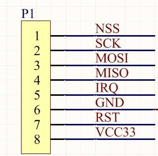
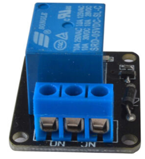
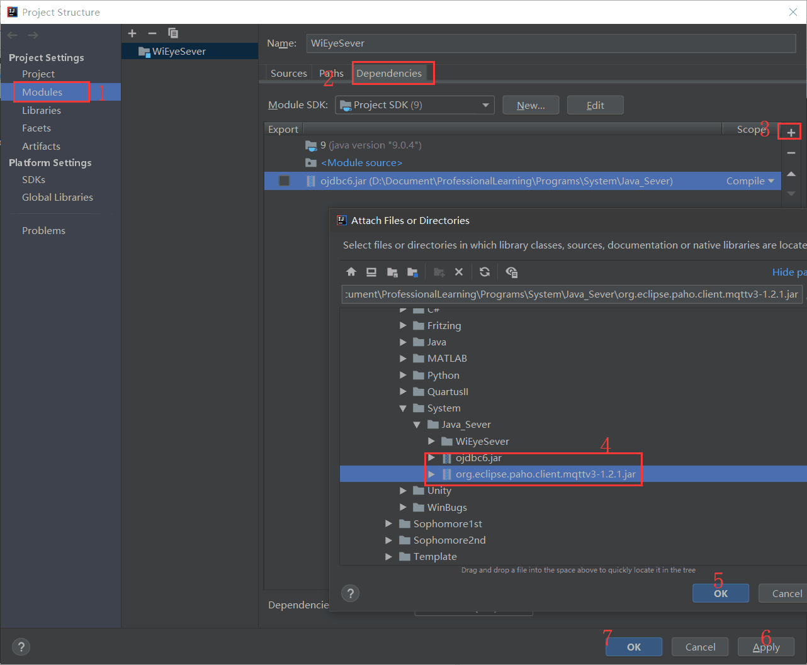

# WiEye-LIMS User Manual

​	实验室信息管理系统用户使用手册，包括了各部分模块的组成原理以及各种开发环境的搭建。此文件为MarkDown格式编写，适于使用支持MarkDown格式的编辑器查看（Typora是一款轻便简洁的Markdown编辑器，支持即时渲染）

目录：

[TOC]

----

## 1. 各模块原理介绍

​	此部分介绍了系统各个模块的组成原理以及所使用的方法，门禁设备部分对各个使用的模块做简要介绍，定位步态识别系统部分介绍工作流程，服务器部分介绍通信协议以及服务器的组成

### 1.1 门禁系统各模块原理

​	门禁系统主要由LOLIN WEMOS mini 的MCU（微处理器，集成了提供Wi-Fi支持的ESP8266的32位处理机）、OLED（128×64）显示屏、电容触摸键盘、RFID阅读器（MFRC522）、继电器（SRD-05VDC-SL-C）以及指纹模块（FPM10A）组成。下面将一一介绍这些模块以及通信基础。

#### 1.1.1 通信基础——I2C，SPI，MQTT

I2C，SPI：待补充；

MQTT通信协议

​	MQTT，即消息队列遥测传输（Message Queuing Telemetry Transport），是一种在TCP/IP协议族上发布/订阅式的消息协议。这是一种是是为大量计算能力有限，且工作在低带宽、不可靠的网络的远程传感器和控制设备通讯而设计的协议。MQTT通信协议的特点有：

1. 使用发布/订阅消息模式，提供一对多的消息发布，解除应用程序耦合；
2. 对负载内容屏蔽的消息传输；
3. 小型传输，开销很小（固定长度的头部是 2 字节），协议交换最小化，以降低网络流量。

​	MQTT使用客户端/服务器方式进行工作，在协议中，服务器是代理（Broker），客户端有发布者（Publisher）和订阅者（Subscriber），消息的发布者可以同时是订阅者。发布的消息分为主题和负载两个方面，主题是消息的类型，订阅者订阅该主题后，能够收到该主题的消息内容。

​	MQTT服务器位于消息发布者与订阅者之间，它接受来自客户的网络连接，接受客户发布的应用信息，处理来自客户端的订阅和退订请求以及向订阅的客户转发应用程序消息。客户端的主要流程如下：1. 与服务器建立连接（Connect）；2. 订阅一个主题的消息（Subscribe）；3. 接收其他客户端发送的消息/发布一个特定主题的消息； 4. 删除订阅的主题；5. 断开连接。MQTT协议有一个重要的心跳机制，指定连接最大空闲时间T，当客户端检测到连接空闲时间超过T时，必须向Broker发送心跳报文PINGREQ，Broker收到心跳请求后返回心跳响应PINGRESP。若Broker超过1.5T时间没收到心跳请求则断开连接，并且投递遗嘱消息到订阅方；同样，若客户端超过一定时间仍没收到心跳响应PINGRESP则断开连接。


#### 1.1.2 LOLIN WEMOS D1 mini


​	这款[WEMOS D1 mini](https://wiki.wemos.cc/products:d1:d1_mini)是一款有4MB Flash存储空间的Wi-Fi板子，支持装载ESP8266，其外观小巧，能够支持I2C通信、SPI通信，使用Micro USB接口与电脑进行通信（烧录下载程序），并且兼容Arduino编程、NodeMCU编程。下表为它的技术参数：

表1 WEMOS D1 mini的技术参数

| 项目          | 类别                    |
| ------------- | ----------------------- |
| 微处理器      | ESP-8266                |
| 工作电压      | 3V（提供5V对外供电）    |
| 数字I/O引脚   | 11个                    |
| 模拟输入引脚  | 1个（最大工作电压3.3V） |
| 时钟频率      | 80MHz/160MHz            |
| Flash         | 4MB                     |
| Length        | 3g                      |
| 尺寸（长x宽） | 34.2mmx25.6mm           |

该单片机能够很好满足我们工程的要求，引脚接口够用，下表为各个引脚的功能以及主要用途

表2 WEMOS D1 mini的引脚功能

| 引脚 | 功能             | 说明                                         |
| ---- | ---------------- | -------------------------------------------- |
| Tx   | TXD              | 串口发送端，与Micro USB的串口共用            |
| Rx   | RXD              | 串口接收端，共用                             |
| A0   | 模拟输入         | 最大3.3V输入                                 |
| D0   | IO               | 只有I/O功能，不支持中断/PWM/I2C              |
| D1   | IO，SCL          | 默认为I2C通信的时钟线                        |
| D2   | IO，SDA          | 默认为I2C通信的数据线                        |
| D3   | IO，10k上拉      | 有上拉电阻，默认连接Flash                    |
| D4   | IO，10k上拉，LED | 有上拉电阻，默认连接ESP8266的内置LED（蓝色） |
| D5   | IO，SCK          | 默认为SPI通信的时钟线                        |
| D6   | IO，MISO         | 默认为SPI通信的MISO线（主机输入）            |
| D7   | IO，MOSI         | 默认为SPI通信的MOSI线（主机输出）            |
| D8   | IO，10k上拉，SS  | 默认为SPI通信的从机选择线                    |
| G    | GND              | 地线                                         |
| 5V   | 5V               | 电源线，5V电压                               |
| 3V3  | 3.3V             | 电源线，3.3V电压                             |
| RST  | Reset            | 重置引脚，置为低一段时间后置为高复位         |

#### 1.1.3 电容触摸键盘：Touch kit Keypad


​	该电容触摸键盘能够让用户有更好的输入体验，只需轻轻一碰，就完成了输入。该键盘配合相应的网络组件使用，即可实现I2C通信，使用4条线（2条I2C通信线，2条电源线/地线）即可实现键盘输入，方便快捷。该网络板工作在3.3V电压下，使用I2C通信协议与单片机进行通信，I2C的默认地址为0x5B，使用封装好的库函数，即可快速地得到输入按键（CapaTouch.keyPad())，例子程序为MPR121/Examples/Keypad。具体的工作原理为，使用I2C协议与网络板通信，网络板时刻接收电容键盘的按键，当超过一定阈值（电容灵敏度调整）后，记录按下的按键，当单片机得到这个按键后（为32位01比特串），通过判断相应位的情况输出按下的按键（0-12）其中0-9分别代表数字0-9，11为'*'，12为'#'；熟悉这些为之后处理异常（按键不灵敏、按键失效）的情况有帮助。下表为01比特串与返回的数据对应关系，从mpr121.cpp可以得出（line248-263）。

表3 MPR121库函数中对返回数据的说明

| 16进制输入 | 按下按键 |
| ---------- | -------- |
| 0x0001     | 1        |
| 0x0002     | 4        |
| 0x0004     | 7        |
| 0x0008     | 11       |
| 0x0010     | 2        |
| 0x0020     | 5        |
| 0x0040     | 8        |
| 0x0080     | 0        |
| 0x0100     | 3        |
| 0x0200     | 6        |
| 0x0400     | 9        |
| 0x0800     | 12       |

#### 1.1.4 OLED显示屏：0.96寸


OLED即有机发光二极管，其轻薄、省电等特性，在03年开始这种显示屏在MP3播放器上广泛使用，其寿命长，是LCD显示屏无法比拟的，其技术参数如下表所示：

表4 0.96寸OLED显示屏技术参数

| 项目             | 说明                 |
| ---------------- | -------------------- |
| 控制芯片         | SSD1306              |
| 工作温度         | -40～70℃             |
| 引脚数量         | 4                    |
| 接口类型         | I2C接口              |
| 尺寸（长x宽x高） | 29.5mmx27.35mmx2.7mm |
| 电源             | 2.2V～5.5V           |
| 分辨率           | 128x64               |
| 显示颜色         | 白色                 |
| 重量             | 5g                   |

使用Adafruit GFX库文件以及Adafruit SSD1306库即可实现各种线条、图片的显示，该OLED显示屏使用I2C进行通信，在显示时，先画出线条、图形，然后写入OLED显示屏的缓存中，最后使用.display()方法将画好的图片进行显示，详细的例子程序为：文件->示例->Adafruit SSD1306->ssd1306_128x64_i2c，例子程序使用各种方法画出各种图形，也能够使用print()方法写出文字，使用setTextSize()方法控制字体大小，在工程中各种的函数说明如下：

表5 OLED显示实用函数

| 函数             | 输入                   | 说明                                  |
| ---------------- | ---------------------- | ------------------------------------- |
| clearDisplay     | void                   | 清除屏幕的所有显示                    |
| setTextSize      | 1-4                    | 设置字体大小，1为16像素大小           |
| setTextColor     | (FG(, BG))             | 设置字体颜色以及北京颜色              |
| setCursor        | (y,x)                  | 设置光标位置(左上为(0, 0))            |
| print()/ write() | Char                   | 写出一个字（属性由上面函数先设置）    |
| drawBitmap()     | (x,y,byte[],len,wid,1) | 在(x,y)处画出长len像素，宽wid像素的图 |
| display()        | void                   | 显示图形                              |

#### 1.1.5 RFID阅读器：MFRC522


​	工程使用的是ISO/IEC 1443 TypeA协议，这里对其作简要介绍（可以不看）。ISO 14443 Type A 是由恩智浦半导体（NXP）等公司最先开发和使用的非接触式芯片技术，其标签芯片主要有：Mifare_Light、Mifare1、Mifare Pro等。此次实验主要使用Mifare1型卡，下面简要介绍其主要指标及工作原理。Mifare1型卡（下简称M1卡）是符合ISO/IEC7810协议的识别卡，作为邻近卡（PICC）有协议规定的ID-1型卡的物理特性和尺寸（85.6mm×54mm×0.76mm，角半径3.18mm），还有抗紫外线、抗X-射线、动态弯曲应力、动态扭曲应力和机械强度的要求。M1卡内含加密控制的逻辑和通讯逻辑电路，典型芯片能够保存数据10年，工作在-20℃~50℃之间，通信速率106Kbps，读写距离10cm以内。M1卡存储器为8Kb的E²PROM，划分为16个扇区，每个扇区由4块（块0、块1、块2、块3）组成。M1卡与读卡器通信的工作原理如下：读写器向M1卡发一组固定频率的电磁波，卡片内有一个LC串联谐振电路，其频率与读写器发射的频率相同，在电磁波的激励下，LC谐振电路产生共振，从而使电容内有了电荷，在这个电容的另一端，接有一个单向导通的电子泵，将电容内的电荷送到另一个电容内储存，当所积累的电荷达到2V时，此电容可做为电源为其它电路提供工作电压，将卡内数据发射出去或接取读写器的数据。

​	M1卡与读卡器通信的工作原理如下：读写器向M1卡发一组固定频率的电磁波，卡片内有一个LC串联谐振电路，其频率与读写器发射的频率相同，在电磁波的激励下，LC谐振电路产生共振，从而使电容内有了电荷，在这个电容的另一端，接有一个单向导通的电子泵，将电容内的电荷送到另一个电容内储存，当所积累的电荷达到2V时，此电容可做为电源为其它电路提供工作电压，将卡内数据发射出去或接取读写器的数据。M1卡与读写器的通讯符合ISO9798的三次认证技术。在读写器选定要处理的卡片之后，读写器确定要访问的扇区号，并对该扇区号进行密码校验，在三次相互认证之后就可以通过加密流进行通讯。三次认证的流程如下：首先卡想读写器发送随机数RB；读写器收到RB后向卡发送令牌TOKEN AB，其中包含随机数RA；卡对TOKEN AB解密，并校验RB是否与TOKEN AB 中的RB一致，若校验正确，则卡向读写器发送令牌TOKEN BA；读写器对TOKEN BA解密，并校验RA是否与TOKEN BA中的RA一致，若一致则三次认证结束，过程中出现差错必须从新开始。


​	本工程使用的RFID阅读器为MFRC522，使用的库封装了上述初始化、读卡、写卡等功能，但读者应当掌握卡片分扇区以及每个扇区密码控制的机制，对之后开发认证机制有帮助。单片机与MFRC522 之间使用SPI进行通信，在开始前进行初始化操作，然后在正常工作中进行读卡操作。主要的函数以及说明如下表所示：

表6 MFRC522库函数说明

| 函数                  | 参数                          | 说明                                                        |
| --------------------- | ----------------------------- | ----------------------------------------------------------- |
| PCD_ReadRegister      | int                           | 底层函数，底层用这个直接与读卡器通信，为读取特定字节的数    |
| PCD_Init              | void                          | 阅读器的初始化，包含硬件以及软件的初始化（写寄存器）        |
| PICC_IsNewCardPresent | void                          | 判断是否有新的卡出现，新的卡是指没有halt的卡                |
| PICC_ReadCardSerial   | void                          | 进行三次握手验证，并且从中读出卡片ID信息                    |
| PICC_GetType          | .uid.sak                      | 根据卡片的信息读取卡片的类别                                |
| PICC_HaltA            | void                          | 去激活一张卡片                                              |
| PCD_Authenticate      | (Key, blocknum, key[], uid[]) | 对卡片的其中一个扇区进行认证，认证成功后才可以进行读取/写入 |
| MIFARE_Read           | Blocknum, byte[],&size        | 读取一定长度的信息，存入byte[]数组中                        |

接线方面，从上到下分别为从机选择、时钟线、MOSI、MISO、中断线、地线、重置线以及电源线8个接口，其中IRQ与RST在本工程中未使用（编程时候RST=UINT8_MAX），其余的线与WEMOS D1mini相应的端口相连即可（D8-SS，D5-SCK，D7-MOSI，D6-MISO，GND-GND，3V3-VCC）



#### 1.1.6 光学指纹模块：FPM10A


​	光学指纹模块带有FLASH存储器，用于存储指纹，并可与TTL串行接口的任何微控制器或系统一起使用。这些模块可以添加到安全系统、门锁、考勤系统。下面对光学指纹的原理作简要介绍（可以不看）。利用光的折摄和反射原理，将手指放在光学镜片上，手指在内置光源照射下，光从底部射向三棱镜，并经棱镜射出，射出的光线在手指 表面指纹凹凸不平的线纹上折射的角度及反射回去的光线明暗就会不一样。用棱镜将其投射在电荷耦合器件上 CMOS 或者 CCD 上，进而形成脊线(指纹图像中具有一定宽度和走向的纹线)呈黑色、谷线(纹线之间的凹陷部分)呈白色的数字化的、可被指纹设备算法处理的多灰度指纹图像。指纹识别具有六大特征，从普遍意义上来讲，可以定义指纹的两类特征来进行指纹的验证。总体特征和局部特征，总体特征是指那些用人眼直接就可以观察到的特征，如基本纹型，模式区，核心点，三角点，式样线，纹数等。上位机通过不同的通信途径，发送指令驱使指纹模块快速捕获按压在指纹传感器 感应区的手指纹路图像，从而获得一幅完整的指纹图像;为了得到比较准确的指 纹特征点，指纹图像预处理一般要经过图像增强(滤波去掉噪声)、计算方向图、 二值化和细化等过程，最后提取出指纹特征信息。

​	光学指纹模块使用串口与单片机进行通信（TTL串行接口），其技术参数如下表所示：

表7 FPM10A光学指纹模块的技术参数

| 项目       | 说明              |
| ---------- | ----------------- |
| 工作电压   | 3.6V～6V          |
| 背光颜色   | 绿色              |
| 接口       | UART-TTL          |
| 默认波特率 | 9600              |
| 存储器     | 能够存储127个指纹 |

详细的例子程序以及说明可以参照[基于Arduino开发板的光学指纹识别模块（FPM10A）指南](https://www.yiboard.com/thread-820-1-1.html)以及模块的例子程序：文件->示例->Adafruit Fingerprint Sensor Library-> enroll/fingerprint两个文件。对于接线，可以按照指南说明，在另一端若不使用Arduino，而使用WEMOS D1 mini，请将端口改为(D4,D3)，不使用TxD与RxD端口，否则无法进行调试。

接线方面，根据指南，上方两根线不使用，下方四根线分别进行接线，4根接线分别为(3V3-VCC，D4-Tx，D3-Rx，GND-GND)

表8 指纹传感器与WEMOS mini D1的接线

| 指纹传感器 | WEMOS D1 mini   |
| ---------- | --------------- |
| VCC        | 3V3 / 5V 电源线 |
| Tx         | D4（串行接口）  |
| Rx         | D3（串行接口）  |
| GND        | GND             |


#### 1.1.7 继电器模块：SRD-05VDC-SL-C



​	继电器我们在初中物理的时候学习过，是一种通过小电流控制衔铁的开闭来控制大电流的电子器械的一种方式，电磁式继电器一般由铁芯、线圈、衔铁、触点簧片等组成的。只要在线圈两端加上一定的电压，线圈中就会流过一定的电流，从而产生电磁效应，衔铁就会在电磁力吸引的作用下克服返回弹簧的拉力吸向铁芯，从而带动衔铁的动触点与静触点（常开触点）吸合。当线圈断电后，电磁的吸力也随之消失，衔铁就会在弹簧的反作用力返回原来的位置，使动触点与原来的静触点（常闭触点）释放。这样吸合、释放，从而达到了在电路中的导通、切断的目的。对于继电器的“常开、常闭”触点，可以这样来区分：继电器线圈未通电时处于断开状态的静触点，称为“常开触点”；处于接通状态的静触点称为“常闭触点”。

​	模块的具体介绍以及例子程序可以在[Arduino学习(六) 继电器实验](https://blog.csdn.net/c80486/article/details/52622031)中找到，控制较为简单，这里不再详细说明，本工程使用D0作为控制端口，只是使用输出高低电平即可达到目的。

#### 1.1.8 门禁磁吸：祖程（ZUCON）电磁锁足280公斤拉力(5线)


#### 1.1.9 喇叭：0.5W 扬声器（待补充）


​	本工程拟使用扬声器作另一种反馈信息的方式，但目前还没有开发完成，用户可以利用自己所学的嵌入式开发经验，使用PWM的方法让扬声器发出人声（如工程文件下的已开锁.mp3）。这里对其不做过多介绍。

### 1.2 定位步态识别系统原理

（相关技术原理请联系欧润民，email: issacrunmin@whu.edu.cn）。

### 1.3 服务器基本组成


---

​	接下来我们对系统各部分模块的集成开发环境 (IDE)进行介绍以及搭建，让用户能够在经过下述步骤后，成功组成一个可用的系统。

## 2 门禁设备开发

​	本部分对门禁设备的IDE进行搭建，以及对各种依赖库函数进行配置。

### 2.1 Arduino IDE 以及适用于ESP8266开发环境搭建

​	Arduino 提供了功能强大的集成开发环境，这让兼容Arduino硬件的编程和下载程序编的非常简单，软件能够运行在Windows、Mac OS以及Linux上。[Arduino-Software](https://www.arduino.cc/en/Main/Software?setlang=cn) 提供了ArduinoIDE的下载，对应用户的系统版本，选择合适的安装包进行下载（Windows选用第一个[Windows 安装包](https://downloads.arduino.cc/arduino-1.8.9-windows.exe) (目前版本1.8.9)即可）

​	软件安装按照各系统正常的安装方法即可，这里提供Windows 10的安装软件方法（以Arduino IDE为例），其余IDE的下载安装方法，如无特殊说明，皆安装一般软件安装方式进行：

> 打开下载好的arduino-1.8.9-windows.exe
>
> 
>
> 
>
> 点击"I Agree"->(默认组建全部安装，400MB左右空间)点击"Next"->选择安装路径，"Install"->稍等片刻(Completed)->"Close"

​	安装完毕后，打开Arduino IDE，并进行下述配置以兼容ESP8266芯片以及本项目的编程：

> 1.文件->首选项 (Ctrl+,) 在“附加开发板管理器网址”中粘贴如下网址：(不需要'')->点击"好"
>
> Tips: 项目文件夹位置最好不要放在系统盘（C盘），勾选"显示行号"和"启用代码折叠"提升用户体验
>
> `http://arduino.esp8266.com/stable/package_esp8266com_index.json`
>
> 
>
> 2.工具->开发板->开发板管理器（注意与"项目"->"加载库"->"管理库"进行区分）
>
> 等待平台索引下载完成，在上方白色搜索框中输入"ESP8266"，得到最后一个esp8266 by Community 选择合适的版本进行安装（当前最新版本为2.5.2）等待一段时间安装完毕。注意根据网络状态，下载的时间从几分钟到几十分钟不等，建议在下载期间进行其他平台安装，出错请转往[**5 Trouble Shoting**](#trouble_shot)。
>
> 
>
> 下载完毕后选用新的开发板：工具->开发板:"…"->(ESP 8266 Boards(2.5.2)) LOLIN(WEMOS)D1 & D2 & mini
>
> 
>
> 3."项目"->"加载库"->"管理库"（Ctrl+Shift+I）
>
> 可在管理库界面搜索库进行安装，为实现各模块的控制，需要加载的库函数有如下（括号内为目前最新版本，这些库函数可以在管理库中安装，也可以直接将项目文件夹的libraries下文件夹放入libraries中，可选目录有{项目文件夹}/libraries—前面首选项的Tips介绍；{Arduino安装目录}/libraries— 安装目录的libraries文件夹，所有工程都会引用到）：
>
> - Adafruit Fingerprint Sensor Library（1.1.2）: 控制指纹模块的库函数；
> - Adafruit GFX （1.5.5）: OLED显示屏需要的库函数，画图形所需；
> - Adafruit SSD1306（1.2.9）：OLED显示屏需要的库函数，为I2C通信协议；
> - MFRC522 SPI（1.4.4）：RFID阅读器SPI通信协议库；
> - MPR121（1.2.0）：电容键盘I2C控制库；
> - PubSubClient by Nick O'Leary（2.7.0）：Wi-Fi的MQTT通信协议；
> - ArduinoDES：标准加密协议（在管理库页面找不到，需要将项目中libraries中的ArduinoDES复制到安装目录下的libraries中）；

### 2.2 Arduino IDE对项目文件进行编译上传

​	进行上述配置、开发板以及库加载后，即可进行项目的编译上传，打开本项目的AccessSys_v1.ino文件（文件->打开/Ctrl+O，选择文件），确认开发板为"LOLIN(WEMOS)D1 & D2 & mini"，进行编译，出错请转往[**5 Trouble Shoting**](#trouble_shot) 直到编译成功。


### 2.3 各个模块连接——代码分析

​	各个模块都只有{模块名}_Task()函数进行分离，可以分开在不同的文件中；而loop() 和 Main_Task()函数则是将所有模块进行调度分配。各个任务中根据State全局变量的不同，进行不同的任务，State以及对应的解释如下：

| State |       解释        |
| :---: | :---------------: |
|   1   |     正常工作      |
|   2   | 低功耗模式/未定义 |
|   3   |     安全模式      |
|   4   |       开门        |

下面对每个模块的工作流程作介绍，详细的介绍在每个任务模块的函数前面，写在了代码中

OLED_Display_Mode(): OLED的主要任务函数，主要是根据当前各个模块的状态以及显示字符串的变化进行刷新。

 EEPROM_Read() and EEPROM_Write(): 读取EEPROM，从Addr开始的len个数据，送到Re[]数组中，应当保证Re足够长，防止内存泄露。EEPROM_Write()类似

Task_Wifi(): Wi-Fi的主要任务函数，在初始化过程中，连接特定的热点，并设定特定的MQTT代理IP地址以及回调函数；在正常模式中，进行重连的判断以及连上代理服务器后在"WieyeClient"中发布自身的序列，监听自身序列的主题（Wieye00007AB7），在{自身主题}_out （Wieye_00007AB7_Out）中发布考勤信息。正常情况下调用client.loop()函数进行操作。


Task_Reader():读写器的主要任务函数，在初始化阶段通过SPI与MFRC522进行通信，得到版本信息，判断版本是否合法以验证读卡器的安全性。在正常状态下，每次判断是否有新的卡出现，出现后读取卡片信息（若选择认证，则验证其中一个block的密钥以检测是否是合法卡片，若不选择认证则可以兼容校园卡）；在安全模式下，读取卡片与正常模式下一样。


Task_Finger(): 指纹模块的主要函数，初始化时候多次尝试是否能够连接（用验证密码的方式进行连接），在主函中也有断开重连的过程，在正常工作中，主要的过程是读取一张图像，判断是否有手指，然后进行特征提取与分析，根据置信度确定是否有合法用户进行考勤，若有则通过EEPROM读取绑定的卡片信息进行发布。在安全模式中，根据指令进行enroll。具体的请看模块的例子程序enrool和fingerprint(文件->示例->Adafruit Fingerprint Sensor Library->enroll/fringerprint)


硬件的连接如图所示，接口如表所示：


| MCU 接口 | 模块接口                           |
| :------: | ---------------------------------- |
|    D0    | 继电器I/O                          |
|    D1    | I2C通信的时钟线（键盘、OLED）      |
|    D2    | I2C通信的数据线（键盘、OLED）      |
|    D3    | 指纹模块的Tx端（连接指纹模块的Rx） |
|    D4    | 指纹模块的Rx端（连接指纹模块的Tx） |
|    D5    | SPI通信的时钟线                    |
|    D6    | SPI MISO                           |
|    D7    | SPI MOSI                           |
|    D8    | SPI 的从机选择                     |

## 3 定位与步态识别系统的开发

​	本部分使用MATLAB<sup>TM</sup>进行人员定位以及步态识别系统的开发。MATLAB是一个矩阵数据处理的强大工具，能够进行数字信号处理、模式识别、系统建模仿真等功能。本部分略过安装以及运行教程，因本部分工程需要在支持Intel 5300 NIC的电脑中进行，配置过于繁琐复杂，需要安装Ubuntu 14.04，安装Matlab 2018b，安装csi-tools for Linux等，目前尚未开放使用，敬请期待。

---

## 4 服务器以及通信的搭建

​	本部分对Java服务器，XAMPP网页服务器，MQTT代理的搭建。

### 4.1 网页服务器搭建

​	我们使用XAMPP进行网页服务器的搭建，XAMPP即Apache+MySQL+PHP+PERL，是一个功能强大的建站集成软件包，是一个很容易安装配置使用的集成软件。

​	我们在[XAMPP下载官网](https://www.apachefriends.org/index.html) 进行下载，选择合适的系统以及位数进行安装等待长时间后完成（建议搭建起他开发环境来等待）。完成后按照默认步骤安装（不安装在系统盘中，安装路径为D:/XAMPP）等待安装完成。之后打开XAMPP Control Pannel，配置必要的信息（若与已安装的数据库、网页服务器冲突），点击Apache和MySQL的Start，开启服务。然后点击右边的Shell，进行数据库配置（：之前的不需要输入，Query OK ……等行不需要输入（这是输出），命令复制到";"即可）。


```sql
#: mysql -u root -p
Enter password: 
......
Type 'help;' or '\h' for help.
MariaDB[(none)]>: CREATE USER 'wieyetech'@'%' IDENTIFIED by '31415';
Query OK, 0 rows affected (0.002sec)
MariaDB[(none)]>: CREATE DATABASE wieye; # 最好是使用PHPmyAdmin进行数据库创建如XAMPP_4.png 所示
Query OK, 1 row affected (0.003sec)
MariaDB[(none)]>: GRANT ALL PRIVILEGES ON wieye.* to 'wieyetech'@'%';
Query OK, 0 rows affected (0.002sec)
MariaDB[(none)]>: FLUSH PRIVILEGES;
Query OK, 0 rows affected (0.002sec)
MariaDB[(none)]>: SHOW GRANTS FOR wieyetech;
+-------------------------------------------------------------------------+
| Grants for wieyetech@%  															                 |
+-------------------------------------------------------------------------+
| GRANT USAGE ON *.* TO 'wieyetech'@'%' IDENTIFIED BY PASSWORD '*EA6C47E3C0D84BF5719D8163705E914E7ADF33A1' |
| GRANT ALL PRIVILEGES ON `wieye`.* TO 'wieyetech'@'%' |
+-------------------------------------------------------------------------+
2 rows in set (0.001 sec)
MariaDB[(none)]>: exit;
Bye
#: mysql -u wieyetech -p
Enter password: *****
......
Type 'help;' or '\h' for help.
MariaDB[(none)]> use wieye;
Database changed
MariaDB[wieye]> CREATE TABLE `wieye`.`Student`(
    `userNO` CHAR(13) NOT NULL COMMENT '学号',
    `cName` VARCHAR(64) NOT NULL COMMENT '姓名',
    `specialty` VARCHAR(64) NULL COMMENT '专业',
    `domainId` VARCHAR(16) NULL COMMENT '班级',
    `sex` CHAR(2) NULL COMMENT '性别',
    `idCard` VARCHAR(32) NOT NULL COMMENT '卡片ID',
    `eName` VARCHAR(64) NULL COMMENT '课程名',
    `quarters` VARCHAR(32) NULL COMMENT '职务',
    `mobile` VARCHAR(16) NULL COMMENT 'QQ号码',
    `workStartTime` DATE NULL COMMENT '登记日期',
    `joinCompanyTime` DATE NULL COMMENT '开始日期',
    `leaveCompanyTime` DATE NULL COMMENT '结束日期',
    `tecCompetence` VARCHAR(128) NULL COMMENT '技术能力',
    `remark` TEXT NULL COMMENT '备注'
) ENGINE = InnoDB COMMENT = '学生信息';
Query OK, 0 rows affected (0.244 sec)

MariaDB[wieye]> CREATE TABLE `wieye`.`Teacher`(
    `TeacherNo` VARCHAR(32) NOT NULL COMMENT '教师编号',
    `teacherName` VARCHAR(32) NOT NULL COMMENT '教师姓名',
    `eName` VARCHAR(64) NULL COMMENT '课程名',
    `idCard` VARCHAR(32) NOT NULL COMMENT '卡片id’ ,  `remark` VARCHAR(256)NULL  COMMENT ‘备注'
) ENGINE = InnoDB COMMENT = '教师信息，用于查看考勤记录';
Query OK, 0 rows affected (0.308 sec)
MariaDB[wieye]> CREATE TABLE `wieye`.`Attendance`(
    `NO` INT NOT NULL COMMENT '序号',
    `userNo` VARCHAR(13) NOT NULL COMMENT '学号',
    `ACDate` DATETIME NOT NULL COMMENT '签到时间',
    `State` INT NULL COMMENT '签到情况',
    `ACState` INT NULL COMMENT '签到方式',
    `remark` VARCHAR(128) NULL COMMENT '备注'
) ENGINE = InnoDB COMMENT = '考勤表';
Query OK, 0 rows affected (0.234 sec)

MariaDB[wieye]> CREATE TABLE `wieye`.`Class`(
    `Cno` VARCHAR(16) NOT NULL COMMENT '课头号',
    `Cname` VARCHAR(32) NOT NULL COMMENT '课程名',
    `teacherNo` VARCHAR(16) NULL COMMENT '教师编号',
    `classDate` INT(1) NULL COMMENT '课程时间-周几',
    `classStart` INT(2) NULL COMMENT '第几节课开始',
    `classEnd` INT(2) NULL COMMENT '到第几节课结束',
    `remark` VARCHAR(128) NULL COMMENT '备注'
) ENGINE = InnoDB COMMENT = '课程信息';
Query OK, 0 rows affected (0.255 sec)

MariaDB [wieye]> ALTER TABLE `Teacher` ADD PRIMARY KEY(`TeacherNo`);
Query OK, 0 rows affected (1.305 sec)
Records: 0  Duplicates: 0  Warnings: 0

MariaDB [wieye]> ALTER TABLE `Student` ADD PRIMARY KEY(`userNO`);
Query OK, 0 rows affected (0.715 sec)
Records: 0  Duplicates: 0  Warnings: 0

MariaDB [wieye]> ALTER TABLE `Class` ADD PRIMARY KEY(`Cno`);
Query OK, 0 rows affected (0.528 sec)
Records: 0  Duplicates: 0  Warnings: 0

MariaDB [wieye]> ALTER TABLE `attendance` ADD PRIMARY KEY(`NO`);
Query OK, 0 rows affected (0.695 sec)
Records: 0  Duplicates: 0  Warnings: 0

MariaDB [wieye]> ALTER TABLE `Attendance` ADD  CONSTRAINT `UserNO` FOREIGN KEY (`userNo`)REFERENCES `Student`(`userNO`) ON DELETE NO ACTION ON UPDATE RESTRICT;
Query OK, 0 rows affected (1.084 sec)
Records: 0  Duplicates: 0  Warnings: 0

MariaDB [wieye]> ALTER TABLE `Class` ADD  CONSTRAINT `teacherNo_e1` FOREIGN KEY (`teacherNo`)REFERENCES `Teacher`(`TeacherNo`) ON DELETE NO ACTION ON UPDATE RESTRICT;
Query OK, 0 rows affected (0.811 sec)
Records: 0  Duplicates: 0  Warnings: 0

MariaDB [wieye]> INSERT INTO `Student` (`userNO`, `cName`, `specialty`, `domainId`, `sex`, `idCard`, `eName`,`quarters`, `mobile`, `workStartTime`, `joinCompanyTime`, `leaveCompanyTime`,`tecCompetence`, `remark`) VALUES ('2016301500240', ' 欧润民', '物联网工程', '物联网班', '男','FEF238E700000000', '物联网系统综合设计实验', '班长', '877536754', '2019-06-17', '2019-06-17', '2019-08-01', '嵌入式设计；网页编程；服务器', '无');
Query OK, 1 row affected (0.083 sec)

MariaDB [wieye]> INSERT INTO `Student` (`userNO`, `cName`, `specialty`, `domainId`, `sex`, `idCard`, `eName`,`quarters`, `mobile`, `workStartTime`, `joinCompanyTime`, `leaveCompanyTime`,`tecCompetence`, `remark`) VALUES ('2016301500354', ' 徐杨', '物联网工程', '物联网班', '男','FEF238E700000000', '物联网系统综合设计', '学委', '1489384099', '2019-06-17', '2019-06-17','2019-08-01', NULL, '无');
Query OK, 1 row affected (0.077 sec)

MariaDB [wieye]> INSERT INTO `attendance` (`NO`, `userNo`, `ACDate`, `State`, `ACState`, `remark`) VALUES ('1', '2016301500240', now(), '1', '1', NULL), ('2', '2016301500354', now(), '2', '1', NULL);
Query OK, 2 rows affected (0.092 sec),('3', '2016301500240', '2019-06-17', '1', '1', NULL)
Query OK, 2 rows affected (0.089 sec)
Records: 2  Duplicates: 0  Warnings: 0
```

将本工程的JavaScript_Websever/文件夹下的Index.html和static复制到XAMPP的安装目录的htdocs中(D:/XAMPP/htdocs/)，将该目录，然后访问localhost:8080/即可访问页面.


### 4.2 MQTT代理配置

​	本工程我们使用Mosquito作为MQTT的broker（代理），在mosquitto的下载页面中下载对应版本的Mosquitto，Windows可使用二进制文件安装，像一般软件安装方法安装即可。根据Readme_windows.txt，运行需要OpenSSL，请确保[OpenSSL](http://slproweb.com/products/Win32OpenSSL.html)安装并正确配置好环境变量。


​	安装完成后，在安装目录对mosquitto.conf里进行必要配置（默认配置即可）在commander(Win+R, cmd)中输入指令（假设安装文件为D:/Program Files/mosquitto/，默认在C盘）：

`"D:\Program Files\mosquitto\mosquitto.exe" -c "D:\Program Files\mosquitto\mosquitto.conf" -d`

​	这样就能够运行MQTT代理了，若出现Error，则根据信息更改配置信息。（默认情况下64位系统安装OpenSSL依赖后就能够在默认下正常运行）。验证：在另外一个cmd中输入指令

`netstat -an`


若看到有端口号为1883的TCP协议监听（LISTENING），说明已成功部署MQTT协议。在手机端可以下载MQTT应用进行进一步验证：下载MyMQTT应用（豌豆荚），然后电脑和手机联入同一局域网中（假设电脑端IP地址为：192.168.137.1），则在左侧dashboard中进行设置Setting。只需要简单的填入IP地址，其余默认即可，然后订阅（Subscribe）一个主题（Topic），名字为hello，之后发布（Publish）一个Topic='hello'，Message='helloworld'，可以在Dashboard中看到接收到的信息。


### 4.3 Java服务器配置

​	Java服务器主要是接收MQTT信息，进行必要处理以及更新数据库。其作为客户端与MQTT代理通信，但监听公用Topic（WieyeClient）的信息，并根据这些信息监听特定设备的考勤信息，进而写入数据库中。这是一个普通的java程序，装载Mysql的JDBC以及MQTT的Java包即可，本部分对Java运行环境、开发者环境（SDK）以及集成开发环境（IntelliJ IDEA）进行介绍以及服务器的配置。

SDK下载安装：在[Oracle的Java SE](https://www.oracle.com/technetwork/java/javase/downloads/index.html)中的Download JDK，选择合适系统环境进行安装；在Jetbrains的[**IntelliJ IDEA**](https://www.jetbrains.com/idea/)官网上下载社区版（Community）集成开发环境，然后进行安装；安装以及安装完毕后的配置默认即可。


安装配置完成后，在打开IDEA即成开发环境（第一次打开需要配置，点击不要导入设置->next直到出现下面的图即可），选择Open，定位到本工程的"Java_Sever"，选中MQTT文件夹，即可打开本工程。加载完毕后，点按Setup SDK，选择安装的SDK进行配置。


之后，进入Project Structure进行配置：File->Project structure(Ctrl+Alt+Shift+S)。点按Modules->Dependencies->+->JARs or directories进行加载工程目录外（与MQTT同目录）的两个jar文件：ojdbc6.jar和org.eclipse.paho.client.mqttv3-1.2.1.jar。之后勾选Export，点击Apply保存设置，自动重新构建后，没有错误出现，即可构建执行RecvMQTT.java 的主函数进行监听（其他主函数只是用来测试）。



---

## 5 Trouble Shooting 

本部分主要围绕安装过程中遇到的问题进行罗列与相应的解决方法<span id="trouble_shot"/>。

### 5.1 Arduino IDE 及 ESP8266 安装

#### Q1：安装开发板过程缓慢/加载不了开发板索引

A1：若加载不了开发板索引，请检查网络连接，在打开的Arduino代码界面的终端显示处查看出错类型（为JAVA 的RunTime Exception），找到第二个Caused by：


图片：出错界面以及主界面终端信息

1. UnknownHostException: 计算机没有连上网络，请检查网络连接
2. SocketTimeoutException：Arduino IDE与网络连接异常，在Windows下请检查应用的网络防火墙（允许特定应用通过防火墙），或使用不同的网络（如不使用WHU-STU校园网络）
3. SocektException- Connection reset：在下载过程中，由于时间过长，难免会出现Connection reset，这时候只需要重新打开开发板管理器，找到相应esp8266开发板继续下载即可（该下载支持断点续传，无需担心需要重新下载）

#### Q2: 编译过程中出错：mpr121.h: No such file or directory

A2: 版本不同，管理库界面中的MPR121不适合本工程项目（会出现找不到CapaTouch情况），请将本工程目录中的mpr121库复制入libraries中，将原来的库卸载（手动删除，重启IDE）

####Q3: 编译过程中出错：#error("Height incorrect, please fix Adafruit_SSD1306.h!")

A3: 头文件的配置需要更改，由于OLED显示屏有多种尺寸，因此需要适配自己的尺寸，本工程项目所使用的是高度64像素，长度128像素的OLED显示屏，因此打开Adafruit_SSD1306.h（路径在2.1.3所述的两个libraries中的其中一个目录中）就在前几行:

```c
// One of the following three lines must be #define
//#define SSD1306_128_64 ///< DEPRECTAED: old way to specify 128x64 screen
# define SSD1306_128_32   ///< DEPRECATED: old way to specify 128x32 screen
//#define SSD1306_96_16  ///< DEPRECATED: old way to specify 96x16 screene
```

将第三行的SSD1306_128_32注释掉（Ctrl+/），将第二行注释去掉：

```c
// One of the following three lines must be #define
#define SSD1306_128_64 ///< DEPRECTAED: old way to specify 128x64 screen
//# define SSD1306_128_32 ///< DEPRECATED: old way to specify 128x32 screen
//#define SSD1306_96_16  ///< DEPRECATED: old way to specify 96x16 screene
```

保存，再次编译即可。

#### Q4: 电容触摸按键的灵敏度？

A：电容触摸按键的灵敏度可调，详细可以查看库文件（mpr121.h以及mpr121.cpp）或按照论坛[所说的方法](https://www.dfrobot.com/forum/viewtopic.php?f=8&t=1805)进行更改。本工程使用的是默认的灵敏度，在实际工作过程中会存在误输入（即没有人按键也会有输入，已通过按压时间作一定处理，可以降低灵敏度进一步提高准确性）

### 5.2 服务器以及通信代理的搭建

目前按照教程没有发现问题，如有问题欢迎请联系（email：issacrunmin@whu.edu.cn）


